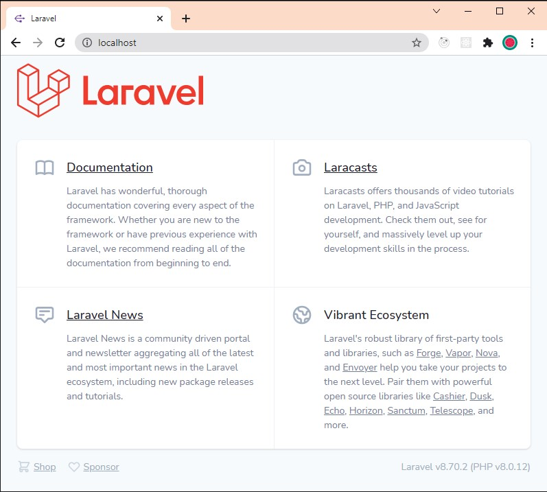
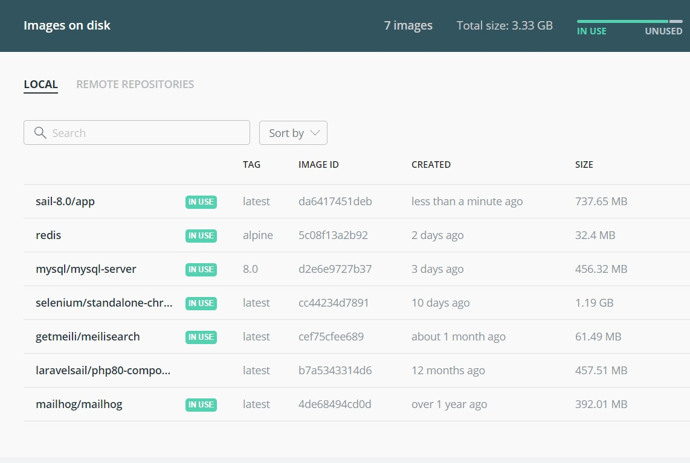
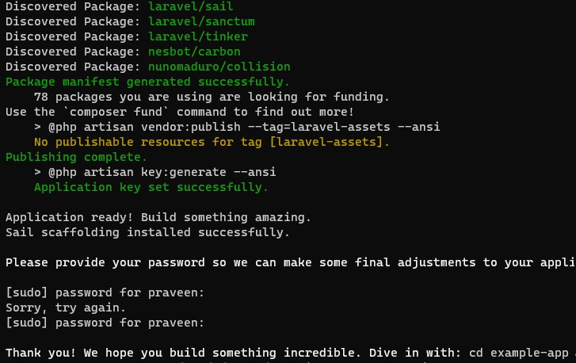
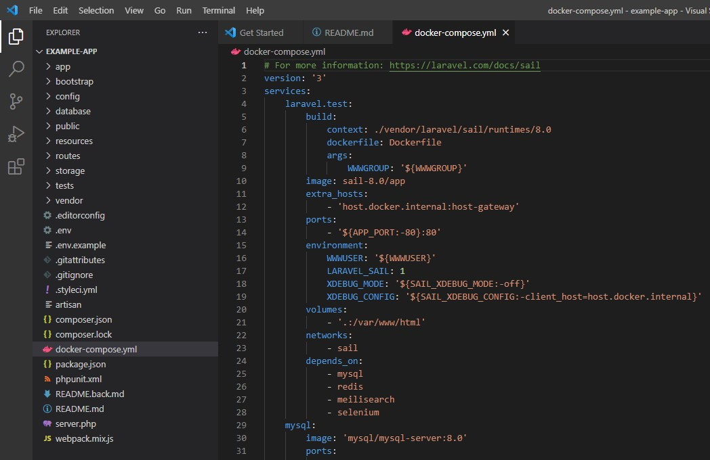

# Laravel Example App

Host: Ubuntu 20.04 on Windows 10

Docker Engine: v20.10.7

This is an example app.



## Laravel Sail Up

```./vendor/bin/sail up```

# Docker Images for Laravel Sail



# Installation of Laravel on Docker with Sail UP



# Directory Structure

This is the default directory structure of Laravel Basic App.


